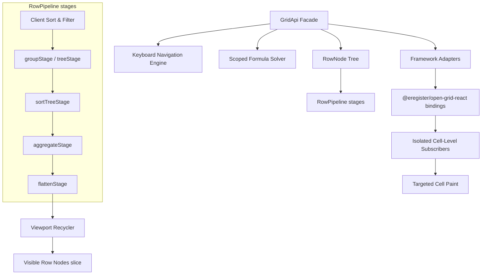

# 🚀 High-Performance Data Grid & Spreadsheet Engine

Open Grid is a lightweight, framework-agnostic grid engine for high-performance virtualized spreadsheets and data grids. Built to handle massive datasets with complex layouts, Open Grid maintains an out-of-render state loop in a centralized engine while exposing granular micro-subscriptions. This allows React, Vue, or vanilla JS wrappers to paint individual cells and rows with surgical precision, entirely bypassing the framework rendering bottleneck.

---

## Alpha Status

Open Grid is currently published as a pre-release alpha surface (`0.1.0-alpha.x`), not a stable `1.x` contract.

- Use `@eregister/open-grid-react` for the supported React entrypoint and `@eregister/open-grid-core` for the supported headless entrypoint.
- Incubating helpers live under `@eregister/open-grid-core/experimental` and `@eregister/open-grid-react/experimental`.
- Anything under an `experimental` entry may change or be removed between alpha releases without compatibility guarantees.

---

## Architecture

The normative architecture constitution is at [docs/architecture/core-target.md](docs/architecture/core-target.md). It defines layer ownership, legal dependency directions, canonical execution flows, feature maturity levels, and the responsibility registry for all major production classes. Plans 089–103 converge the codebase toward that document.

---

## ⚡ Technical Architecture Overview

To bypass virtual DOM performance bottlenecks and eliminate layout thrashing during rapid scrolling, Open Grid decouples raw record arrays from visual presentation using a dynamic **Row Node Tree** and a discriminated union **VisualRow** pipeline:



### Core Architecture Highlights

1. **Stateful RowNode Tree**: Separates raw data records from layout metadata (such as coordinate mappings, dynamic vertical offsets, selection flags, and expansion states).
2. **Discriminated VisualRow Model**: Rather than treating every row strictly as a data-centric `RowNode`, the layout engine outputs a flat, virtualized array of `VisualRow` nodes representing either data rows (`kind: 'data'`), grouping labels (`kind: 'group'`), or nested components (`kind: 'detail'`).
3. **Cellular Value Cache**: Prevents redundant `valueGetter` executions and runtime path-splitting operations by caching computed cell values directly on individual `RowNode` structures until data is modified.
4. **Pre-Compiled Path Getters**: Accessors (such as `user.profile.name`) are compiled into optimized, static functional selectors upon schema registration to avoid continuous garbage collection pressure.
5. **Targeted Micro-Subscriptions**: Cell components subscribe strictly to their coordinates (e.g., `cell:value:row-101:price`). Edits only repaint the exact target cell, formula dependents, and conditional formatting listeners.
6. **Active Viewport Subscription Garbage Collection**: Micro-subscriptions are bound dynamically. Scrolling cells out of the recycled DOM unmounts them, dereferencing their subscriptions to prevent memory leaks in long-running processes.

---

## 🔥 Key Developer Features

Open Grid comes equipped with an extensive suite of built-in features designed for advanced spreadsheet and data dashboard development:

- **High-Performance Virtualization**: Virtualizes both rows and columns dynamically, yielding standard 60 FPS performance even for massive datasets with 100,000+ rows and 1,000+ columns.
- **Sticky Lanes (Pinning)**: Floating stickiness for left/right columns and top/bottom rows with floating headers and scroll boundaries.
- **Excel-like Selections & Drag-to-Fill**: Features interactive multi-range cell selection, arrow keyboard navigation, and an Excel-like purple dashed border drag-to-fill handle with real-time selection telemetry (Sum, Count, Average).
- **Dynamic Multi-Level Row Grouping & Aggregations**: Group records recursively by column fields with automatic, bottom-up parent aggregate calculations (Sum, Average, Min, Max, Count, or custom reducers).
- **Hierarchical Tree Hierarchy**: Support parent-child tree data structures (e.g., file directories) with custom node renderers and dynamic visual indentation depths.
- **Interactive Master-Detail Layouts (Nested Grids)**: Render completely separate, fully interactive sub-grids inside parent detail portals, with live cross-grid state synchronization.
- **Advanced Header Filters & Custom Menus**: Register custom React header popovers for custom filtering, multi-sort, and column settings.
- **Scoped Formulas**: Optional spreadsheet-style formulas using `[rowId:columnField]` references, arithmetic operators, and functions with dependency invalidation.
- **Command History (Undo / Redo)**: Seamless state journaling enabling unlimited undo/redo capability across cell mutations and updates.

---

## 🚀 Getting Started

### 1. Installation

Install Open Grid packages in your monorepo or project.

```bash
pnpm install @eregister/open-grid-core @eregister/open-grid-react
```

### 2. Basic Setup Example

The simplest way to use Open Grid is the single public `<Grid>` component. Pick `mode="client"` or `mode="server"` explicitly, and use `onGridReady` when you need the `GridApi` handle outside the grid tree.

```tsx
import React, { useMemo } from 'react';
import { Grid, type ColumnDef } from '@eregister/open-grid-react';

interface BookRow {
	id: string;
	title: string;
	author: string;
	price: number;
}

export default function BookInventoryGrid() {
	const columns = useMemo<ColumnDef<BookRow>[]>(
		() => [
			{ field: 'id', header: 'Asset ID', width: 100 },
			{ field: 'title', header: 'Book Title', width: 250 },
			{ field: 'author', header: 'Author', width: 180 },
			{
				field: 'price',
				header: 'Price',
				width: 120,
				valueGetter: ({ row }) => `$${row.price.toFixed(2)}`,
			},
		],
		[]
	);

	const rows = useMemo<BookRow[]>(
		() => [
			{ id: 'B-101', title: 'The Pragmatic Programmer', author: 'Andy Hunt', price: 49.99 },
			{ id: 'B-102', title: 'Clean Code', author: 'Robert C. Martin', price: 42.5 },
			{ id: 'B-103', title: 'Designing Data-Intensive Applications', author: 'Martin Kleppmann', price: 54.95 },
		],
		[]
	);

	return (
		<div style={{ width: '100%', height: '500px' }}>
			<Grid
				mode='client'
				rows={rows}
				columns={columns}
				getRowId={(row) => row.id}
				initialState={{ defaultColWidth: 120, defaultRowHeight: 38 }}
				pinLeftColumns={1}
				enableNavigation
			/>
		</div>
	);
}
```

#### When to use `onGridReady` and `useGridApi`

Use `onGridReady` when a parent component needs the `GridApi` handle, and `useGridApi` when a descendant inside the grid tree needs access to the same instance:

```tsx
import { useState } from 'react';
import { Grid, type GridApi } from '@eregister/open-grid-react';

function Toolbar({ api }: { api: GridApi<BookRow> | null }) {
	return (
		<button disabled={!api} onClick={() => api?.exportCsv()}>
			Export CSV
		</button>
	);
}

export function BookGrid({ rows, columns }) {
	const [api, setApi] = useState<GridApi<BookRow> | null>(null);
	return (
		<>
			<Toolbar api={api} />
			<Grid mode='client' rows={rows} columns={columns} onGridReady={({ api }) => setApi(api)} />
		</>
	);
}
```

---

## 🛠️ Advanced Features & Guides

### 1. Row Grouping & Aggregations

Row grouping organizes rows into an expandable folder-like structure based on identical column values. Aggregations allow you to compute summary metrics dynamically for these parent groups.

#### Configuration

To enable row grouping, pass the `groupBy` fields inside the `initialState` configuration. Define aggregates using the pipeline `aggDefs`.

```tsx
import React, { useMemo, useCallback } from 'react';
import { Grid, type ColumnDef, type VisualRow, type GridApi } from '@eregister/open-grid-react';

interface EmployeeRow {
	id: string;
	name: string;
	department: string;
	salary: number;
}

export function GroupedEmployeesGrid({ data }: { data: EmployeeRow[] }) {
	const columns = useMemo<ColumnDef<EmployeeRow>[]>(
		() => [
			{ field: 'id', header: 'ID', width: 100 },
			{ field: 'name', header: 'Full Name', width: 180 },
			{ field: 'department', header: 'Department', width: 150 },
			{ field: 'salary', header: 'Salary', width: 120 },
		],
		[]
	);

	// Custom group row renderer to display summary aggregates
	const groupRowRenderer = useCallback(({ visualRow, api }: { visualRow: VisualRow<EmployeeRow>; api: GridApi<EmployeeRow> }) => {
		if (visualRow.kind !== 'group') return null;

		const expanded = visualRow.expanded;
		const handleToggle = (e: React.MouseEvent) => {
			e.stopPropagation();
			api.toggleGroupExpanded(visualRow.id);
		};

		return (
			<div
				className='flex items-center justify-between px-4 h-full bg-slate-900 border-b border-slate-800 cursor-pointer'
				onClick={handleToggle}
				style={{ paddingLeft: `${visualRow.depth * 20 + 10}px` }}
			>
				<div className='flex items-center gap-2'>
					<span>{expanded ? '▼' : '▶'}</span>
					<span className='font-bold text-xs text-purple-400'>{visualRow.field.toUpperCase()}:</span>
					<span className='text-white font-semibold text-xs'>{String(visualRow.key)}</span>
				</div>
				<span className='text-[10px] bg-purple-950 text-purple-300 border border-purple-800 px-2 py-0.5 rounded-full font-bold'>
					{visualRow.childCount} employees
				</span>
			</div>
		);
	}, []);

	return (
		<div style={{ height: '500px' }}>
			<Grid
				mode='client'
				rows={data}
				columns={columns}
				initialState={{ groupBy: ['department'], groupRowHeight: 42 }}
				groupRowRenderer={groupRowRenderer}
			/>
		</div>
	);
}
```

---

### 2. Hierarchical Tree Data

Hierarchical trees organize rows into nested structures based on a parent-child relationship (ideal for file system directories, organizational charts, or bill of materials).

#### Configuration

To configure tree data, specify the `getParentId` function inside `initialState`. To indent the tree columns, inspect the current `VisualRow`'s `depth` within a custom cell renderer.

```tsx
import React, { useMemo } from 'react';
import { Grid, type ColumnDef, type CellRendererProps } from '@eregister/open-grid-react';

interface FileNode {
	id: string;
	name: string;
	parentId?: string;
	size?: string;
}

// Cell renderer that indents cell content based on tree depth
const TreeNameRenderer = ({ value, rowId, api }: CellRendererProps<FileNode>) => {
	const visualIndex = api.getRowIndexById(rowId) ?? 0;
	const visualRow = api.getVisualRow(visualIndex);
	const depth = visualRow?.depth ?? 0;

	return (
		<div className='flex items-center h-full select-none' style={{ paddingLeft: `${depth * 20}px` }}>
			<span className='mr-2'>{visualRow?.kind === 'group' ? '📁' : '📄'}</span>
			<span className='text-slate-200'>{String(value)}</span>
		</div>
	);
};

export function FileDirectoryGrid({ nodes }: { nodes: FileNode[] }) {
	const columns = useMemo<ColumnDef<FileNode>[]>(
		() => [
			{ field: 'name', header: 'Node Path / Name', width: 300, cellRenderer: TreeNameRenderer },
			{ field: 'size', header: 'Capacity Size', width: 120 },
		],
		[]
	);

	return (
		<div style={{ height: '400px' }}>
			<Grid mode='client' rows={nodes} columns={columns} initialState={{ getParentId: (row) => row.parentId, groupRowHeight: 38 }} />
		</div>
	);
}
```

---

### 3. Interactive Master-Detail Layouts (Nested Grids)

Master-Detail row models render completely custom, expandable components or completely separate interactive sub-grids nested directly under their parent row container.

#### Configuration

Enable master-detail by setting `masterDetailEnabled: true` in your options, and configure detail view heights using `detailRowHeight`. Custom detail rows are rendered with the `detailRowRenderer` prop.

```tsx
import React, { useMemo, useCallback } from 'react';
import { Grid, type ColumnDef, type VisualRow, type GridApi, type CellRendererProps } from '@eregister/open-grid-react';

interface OrderRow {
	id: string;
	customerName: string;
	totalAmount: number;
}

interface OrderItemRow {
	id: string;
	itemName: string;
	price: number;
	quantity: number;
}

// Master grid detail toggle column renderer
const DetailToggleRenderer = ({ rowId, api }: CellRendererProps<OrderRow>) => {
	const isExpanded = api.isDetailExpanded(rowId);
	return (
		<button onClick={() => api.toggleDetailExpanded(rowId)} className='w-5 h-5 font-mono text-purple-400'>
			{isExpanded ? '▼' : '▶'}
		</button>
	);
};

// Separated component for the nested grid portal
const NestedItemsGrid = ({ visualRow, parentApi }: { visualRow: VisualRow<OrderRow>; parentApi: GridApi<OrderRow> }) => {
	if (visualRow.kind !== 'detail') return null;

	const parentOrderId = visualRow.parentId;

	// Mock sub-items associated with parent ID
	const items: OrderItemRow[] = [
		{ id: 'ITM-01', itemName: 'High-Freq Options Feed Sub', price: 2500, quantity: 1 },
		{ id: 'ITM-02', itemName: 'Ultra-Low Latency Port licenses', price: 816.66, quantity: 3 },
	];

	const detailColumns = useMemo<ColumnDef<OrderItemRow>[]>(
		() => [
			{ field: 'id', header: 'Item ID', width: 100 },
			{ field: 'itemName', header: 'Product Item Name', width: 250 },
			{ field: 'price', header: 'Price', width: 100 },
			{ field: 'quantity', header: 'Qty', width: 80 },
		],
		[]
	);

	return (
		<div className='w-full h-full p-4 pl-12 bg-slate-950/90 border-b border-slate-900 flex flex-col gap-2 relative'>
			<div className='text-[10px] text-purple-400 uppercase tracking-widest font-extrabold'>Order Line Items (Parent ID: {parentOrderId})</div>
			<div className='flex-1 min-h-0 border border-slate-850 rounded-lg overflow-hidden bg-slate-900'>
				<Grid mode='client' rows={items} columns={detailColumns} enableNavigation={true} />
			</div>
		</div>
	);
};

export function MasterOrdersGrid({ orders }: { orders: OrderRow[] }) {
	const masterColumns = useMemo<ColumnDef<OrderRow>[]>(
		() => [
			{ field: 'toggle', header: '🔍', width: 45, cellRenderer: DetailToggleRenderer },
			{ field: 'id', header: 'Order ID', width: 120 },
			{ field: 'customerName', header: 'Corporation Client', width: 220 },
			{ field: 'totalAmount', header: 'Value', width: 120 },
		],
		[]
	);

	const detailRowRenderer = useCallback(({ visualRow, api }: { visualRow: VisualRow<OrderRow>; api: GridApi<OrderRow> }) => {
		return <NestedItemsGrid visualRow={visualRow} parentApi={api} />;
	}, []);

	return (
		<div style={{ height: '600px' }}>
			<Grid
				mode='client'
				rows={orders}
				columns={masterColumns}
				initialState={{ masterDetailEnabled: true }}
				detailRowHeight={220}
				detailRowRenderer={detailRowRenderer}
			/>
		</div>
	);
}
```

---

### 4. Custom Column Header Filters

Register fully custom header menu popovers (such as multi-select dropdown filters, date pickers, or custom sorts) using React popovers mounted via custom React Portals inside the column header cell.

#### Configuration

To bind a header popover, register your custom header filter component in `headerMenuComponent` inside the target column definition.

```tsx
import React, { useState } from 'react';
import { useGridApi, type GridApi, type ColumnDef } from '@eregister/open-grid-react';

interface CustomFilterProps {
	colField: string;
	api: GridApi<any>;
	close: () => void;
}

export const StatusHeaderFilter = ({ colField, api, close }: CustomFilterProps) => {
	const state = api.getState();
	const activeFilter = state.filterModel?.[colField];
	const [selectedValue, setSelectedValue] = useState(activeFilter?.filter || '');

	const handleApply = () => {
		const nextFilter = { ...(state.filterModel || {}) };
		if (selectedValue) {
			nextFilter[colField] = {
				type: 'equals',
				filter: selectedValue,
			};
		} else {
			delete nextFilter[colField];
		}
		api.setFilterModel(Object.keys(nextFilter).length > 0 ? nextFilter : null);
		close(); // Closes the header filter popup
	};

	return (
		<div className='flex flex-col gap-2 p-3 bg-slate-900 border border-slate-800 rounded-lg shadow-xl text-white'>
			<span className='text-[10px] font-bold text-slate-400 uppercase'>Select Status</span>
			<select
				value={selectedValue}
				onChange={(e) => setSelectedValue(e.target.value)}
				className='bg-slate-950 border border-slate-850 p-1 rounded text-xs'
			>
				<option value=''>(All Statuses)</option>
				<option value='Active'>Active</option>
				<option value='Pending'>Pending</option>
				<option value='Inactive'>Inactive</option>
			</select>
			<div className='flex justify-end gap-2 mt-2 pt-2 border-t border-slate-800'>
				<button onClick={handleApply} className='bg-purple-600 text-white text-xs px-2.5 py-1 rounded'>
					Apply Filter
				</button>
			</div>
		</div>
	);
};

// Inside ColumnDef registrations:
// {
//     field: 'status',
//     header: 'Fulfillment Status',
//     width: 140,
//     headerMenuComponent: StatusHeaderFilter
// }
```

---

### 5. Built-in Cell Types & Column Type Registry

`@eregister/open-grid-react` ships six ready-to-use cell types — checkbox, date, number, multi-select, dropdown, and tags. Attach them to a column with `type: 'name'` and the grid resolves the renderer and editor automatically, with no component imports needed in your column definitions.

#### Built-in types (no configuration required)

| `type` value | Renderer           | Editor                              |
| :----------- | :----------------- | :---------------------------------- |
| `'checkbox'` | Toggle checkbox    | Toggles on click — no editor needed |
| `'date'`     | DD/MM/YYYY display | Native date picker                  |
| `'number'`   | Mono number        | Stepper with ↑↓ keys                |

```tsx
const columns: ColumnDef<Row>[] = [
	{ field: 'isActive', header: 'Active', width: 70, type: 'checkbox' },
	{ field: 'startDate', header: 'Start Date', width: 145, type: 'date' },
	{ field: 'quantity', header: 'Qty', width: 100, type: 'number' },
];
```

#### Parameterised types via `columnTypes`

Types that need runtime config (options list, formatting, bounds) are registered in the `columnTypes` prop using the helper factories. The type name is then referenced in `ColumnDef.type` exactly like a built-in.

```tsx
import {
	Grid,
	multiSelectColumnType,
	dropdownColumnType,
	numberColumnType,
	type ColumnDef,
	type ColumnTypeDefinition,
	type DropdownOption,
} from '@eregister/open-grid-react';

const STATUS_OPTIONS: DropdownOption[] = [
	{ value: 'Active', color: 'emerald' },
	{ value: 'Pending', color: 'amber' },
	{ value: 'Inactive', color: 'default' },
];

const SKILLS_OPTIONS = ['React', 'TypeScript', 'Node', 'Go', 'Rust'];

// Registered once at module level — references are stable
const MY_COLUMN_TYPES: Record<string, ColumnTypeDefinition<EmployeeRow>> = {
	status: dropdownColumnType(STATUS_OPTIONS),
	skills: multiSelectColumnType(SKILLS_OPTIONS, 3),
	salary: numberColumnType({ prefix: '$', decimals: 2, locale: true }),
	yearsExp: numberColumnType({ suffix: ' yrs', min: 0, max: 50, step: 1 }),
};

const columns: ColumnDef<EmployeeRow>[] = [
	{ field: 'name', header: 'Name', width: 180 },
	{ field: 'status', header: 'Status', width: 130, type: 'status' },
	{ field: 'skills', header: 'Skills', width: 260, type: 'skills' },
	{ field: 'salary', header: 'Salary', width: 130, type: 'salary' },
	{ field: 'yearsExp', header: 'Experience', width: 120, type: 'yearsExp' },
	{ field: 'joinDate', header: 'Joined', width: 145, type: 'date' },
	{ field: 'isPro', header: 'Pro', width: 68, type: 'checkbox' },
];

export function EmployeesGrid({ rows }: { rows: EmployeeRow[] }) {
	return <Grid mode='client' rows={rows} columns={columns} columnTypes={MY_COLUMN_TYPES} />;
}
```

Column-level `renderer` / `cellEditor` always override a type — so you can use a type as a default and override on specific columns.

#### Helper factory reference

| Factory                                       | Options                                                        | Description                                |
| :-------------------------------------------- | :------------------------------------------------------------- | :----------------------------------------- |
| `numberColumnType(opts?)`                     | `prefix`, `suffix`, `decimals`, `locale`, `min`, `max`, `step` | Formatted number renderer + stepper editor |
| `multiSelectColumnType(options, maxVisible?)` | `string[]` option list, visible cap                            | Pill-tag renderer + search dropdown editor |
| `dropdownColumnType(options)`                 | `DropdownOption[]` with `value`, `label`, `color`              | Badge renderer + `<select>` editor         |

---

### 6. Declarative Style Rules

`styleRules` is the recommended way to conditionally style rows, cells, and header cells. It is the grid's declarative styling API: pass a plain array of rule objects and the core styling pipeline applies them directly.

#### Passing rules as a prop

When you own the grid via `<Grid>`, pass `styleRules` directly:

```tsx
import { Grid, type ColumnDef, type StyleRule } from '@eregister/open-grid-react';

const styleRules = useMemo<StyleRule<OrderRow>[]>(
	() => [
		// Row rules — applied to the whole row
		{
			kind: 'row',
			when: (row) => row.status === 'Cancelled',
			rowClass: 'opacity-50 line-through text-slate-500',
		},
		// Cell rules — optionally scoped to a single field
		{
			kind: 'cell',
			field: 'total',
			when: (row) => Number(row.total) > 10_000,
			cellClass: 'text-emerald-400 font-extrabold font-mono',
		},
		// Header cell rules
		{
			kind: 'headerCell',
			field: 'total',
			when: () => true,
			headerCellClass: 'text-emerald-400 font-bold',
		},
		{
			kind: 'headerCell',
			when: (col) => col.field !== 'total',
			headerCellClass: 'font-semibold text-slate-400',
		},
	],
	[]
);

export function OrdersGrid({ rows, columns }: { rows: OrderRow[]; columns: ColumnDef<OrderRow>[] }) {
	return <Grid mode='client' rows={rows} columns={columns} styleRules={styleRules} />;
}
```

All matching rules contribute their class strings (space-joined), so rules are composable. Evaluate order follows array order — later rules can override earlier ones via the CSS cascade.

#### `useStyleRules` — for components that receive `api` as a prop

When a component needs to apply rules from inside the grid tree, use `useGridApi` + `useStyleRules`:

```tsx
import { Grid, useGridApi, useStyleRules, type ColumnDef, type StyleRule } from '@eregister/open-grid-react';

function DashboardRules() {
	const api = useGridApi<StockRow>();
	const styleRules = useMemo<StyleRule<StockRow>[]>(
		() => [
			{
				kind: 'row',
				when: (row) => parseFloat(row.change) > 0,
				rowClass: 'border-l-2 border-emerald-500/60 bg-emerald-950/5',
			},
			{
				kind: 'row',
				when: (row) => parseFloat(row.change) < 0,
				rowClass: 'border-l-2 border-rose-500/60 bg-rose-950/5',
			},
			{
				kind: 'headerCell',
				field: 'change',
				when: () => true,
				headerCellClass: 'text-emerald-400 font-extrabold',
			},
		],
		[]
	);

	useStyleRules(api, styleRules); // applies declarative rules; re-applies when rules reference changes
	return null;
}

function DashboardGrid({ rows, columns }: { rows: StockRow[]; columns: ColumnDef<StockRow>[] }) {
	return (
		<Grid mode='client' rows={rows} columns={columns}>
			<DashboardRules />
		</Grid>
	);
}
```

#### Rule type reference

| `kind`         | Required fields                     | `when` signature                | Applied to                                       |
| :------------- | :---------------------------------- | :------------------------------ | :----------------------------------------------- |
| `'row'`        | `rowClass`                          | `(row, params) => boolean`      | Entire row element                               |
| `'cell'`       | `cellClass`, optional `field`       | `(row, col, params) => boolean` | Single cell; if `field` is set, only that column |
| `'headerCell'` | `headerCellClass`, optional `field` | `(col) => boolean`              | Header cell; if `field` is set, only that column |

`styleRules` is the supported conditional styling surface. Use the `styleRules` prop for declarative configuration, `useStyleRules` inside React grid trees, or `api.setStyleRules(...)` when you need an imperative public API.

---

### 7. Pagination

Open Grid ships a built-in `GridPagination` component and a `useClientGridPagination` hook for slice-level paging. The grid instance itself is now owned by `<Grid>` and surfaced through `onGridReady` / `useGridApi`.

#### Client-side pagination

```tsx
import { Grid, GridPagination, useClientGridPagination, type ColumnDef } from '@eregister/open-grid-react';

export function PaginatedGrid({ allRows, columns }: { allRows: MyRow[]; columns: ColumnDef<MyRow>[] }) {
	const { pageRows, page, pageCount, setPage, totalRows, pageSize } = useClientGridPagination(allRows, {
		pageSize: 50,
	});

	return (
		<div style={{ display: 'flex', flexDirection: 'column', height: '600px' }}>
			<div style={{ flex: 1, minHeight: 0 }}>
				<Grid mode='client' rows={pageRows} columns={columns} />
			</div>
			<GridPagination page={page} pageCount={pageCount} totalRows={totalRows} pageSize={pageSize} onPageChange={setPage} />
		</div>
	);
}
```

#### Server-side pagination

For server grids you manage the page state yourself — just drive your datasource and pass page metadata to `<GridPagination>`:

```tsx
import { Grid, GridPagination, type ColumnDef } from '@eregister/open-grid-react';

const PAGE_SIZE = 100;

export function ServerPaginatedGrid({ columns }: { columns: ColumnDef<MyRow>[] }) {
	const [page, setPage] = useState(0);
	const { datasource, totalRows } = useMyServerDatasource({ page, pageSize: PAGE_SIZE });

	return (
		<div style={{ display: 'flex', flexDirection: 'column', height: '600px' }}>
			<div style={{ flex: 1, minHeight: 0 }}>
				<Grid mode='server' datasource={datasource} columns={columns} />
			</div>
			<GridPagination
				page={page}
				pageCount={Math.ceil(totalRows / PAGE_SIZE)}
				totalRows={totalRows}
				pageSize={PAGE_SIZE}
				onPageChange={setPage}
			/>
		</div>
	);
}
```

#### Theming via CSS custom properties

```css
.my-grid-footer {
	--og-pagination-border: #1e293b;
	--og-pagination-bg: transparent;
	--og-pagination-color: #94a3b8;
	--og-pagination-active-bg: #7c3aed;
	--og-pagination-active-color: #ffffff;
}
```

```tsx
<GridPagination className='my-grid-footer' page={page} pageCount={pageCount} onPageChange={setPage} />
```

#### Custom button content

```tsx
<GridPagination
	page={page}
	pageCount={pageCount}
	onPageChange={setPage}
	renderPrevButton={() => <ChevronLeft size={14} />}
	renderNextButton={() => <ChevronRight size={14} />}
	renderPageInfo={(page, pageCount, total) => (
		<span style={{ marginLeft: 8 }}>
			{total} results · page {page + 1}/{pageCount}
		</span>
	)}
/>
```

---

### 8. Column Value Formatting

`valueFormatter` formats cell text for display without affecting the underlying stored value. `onCopy` overrides what gets written to the clipboard. `onPaste` pre-processes incoming clipboard text before it's committed to the store.

```tsx
const columns: ColumnDef<OrderRow>[] = [
	{
		field: 'price',
		header: 'Price',
		// Shown in the cell: "$149.99"
		valueFormatter: ({ value }) => `$${Number(value).toFixed(2)}`,
		// Copied to clipboard: "149.99" (no symbol — stays numeric when pasted into Excel)
		onCopy: ({ value }) => String(value),
		// Pasted from clipboard: strip "$" before writing to the store
		onPaste: ({ text }) => text.replace(/^\$/, ''),
	},
	{
		field: 'createdAt',
		header: 'Created',
		valueFormatter: ({ value }) => new Date(value as string).toLocaleDateString(),
	},
];
```

`valueFormatter` receives `{ value, rowData, colDef, rowId }`. The formatted string is used in read-only cells and clipboard copy (fallback after `onCopy`). It does **not** affect `getCellValue()` — the raw value is always preserved.

---

### 9. Multi-Level Column Header Groups

Group related columns under a shared spanning header label using `headerGroup` and `headerGroupLevel` on `ColumnDef`. Columns at the same level sharing the same `headerGroup` string are automatically merged into a single spanning cell.

```tsx
const columns: ColumnDef<FinancialRow>[] = [
	{ field: 'symbol', header: 'Symbol', width: 80 },
	{ field: 'q1Revenue', header: 'Q1', headerGroup: 'Revenue', headerGroupLevel: 0, width: 100 },
	{ field: 'q2Revenue', header: 'Q2', headerGroup: 'Revenue', headerGroupLevel: 0, width: 100 },
	{ field: 'q3Revenue', header: 'Q3', headerGroup: 'Revenue', headerGroupLevel: 0, width: 100 },
	{ field: 'q1Cost', header: 'Q1', headerGroup: 'Costs', headerGroupLevel: 0, width: 100 },
	{ field: 'q2Cost', header: 'Q2', headerGroup: 'Costs', headerGroupLevel: 0, width: 100 },
];
```

Levels are zero-indexed. Add a `headerGroupLevel: 1` layer to nest groups within groups for deeper hierarchies.

---

### 10. Column Auto-Sizing

Double-click a column resize handle to auto-size that column to fit its content. Programmatic control is available via the `GridApi`:

```typescript
// Resize a single column to fit its widest cell (header included by default)
api.autoSizeColumn('price');

// Resize all visible columns at once
api.autoSizeAllColumns();

// With options
api.autoSizeColumn('name', { padding: 24, includeHeader: true });
api.autoSizeAllColumns({ padding: 16, minWidth: 60, maxWidth: 400 });
```

**`AutoSizeColumnOptions`**

| Option          | Type      | Default | Description                                            |
| :-------------- | :-------- | :------ | :----------------------------------------------------- |
| `padding`       | `number`  | `16`    | Extra pixels added to the measured content width.      |
| `includeHeader` | `boolean` | `true`  | Include the header cell text in the width measurement. |
| `minWidth`      | `number`  | —       | Clamp the result to at least this many pixels.         |
| `maxWidth`      | `number`  | —       | Clamp the result to at most this many pixels.          |

`autoSizeAllColumns` accepts the same options and applies them uniformly to every visible column.

---

### 11. Grid-Level Clipboard (Copy & Paste)

Built-in clipboard controller. Keyboard shortcuts (`Ctrl+C` / `Ctrl+V`) work automatically on a focused grid. The programmatic API enables copy/paste from toolbar buttons or external triggers.

#### Programmatic API

```typescript
// Copy whatever the user has currently selected
await api.copySelectedRange();

// Copy an explicit row/column range by visual index (rows 0–4, columns 1–3)
await api.copyRange(0, 4, 1, 3);

// Paste TSV from the system clipboard into the current selection anchor
await api.pasteFromClipboard();
```

#### Copy format

Copied data is TSV (tab-separated values), natively compatible with Excel and Google Sheets. Each cell is serialized using the first matching rule:

1. `onCopy` column callback — custom/raw value
2. `valueFormatter` column callback — formatted display string
3. Raw cell value (fallback)

#### Events

```typescript
api.addEventListener(GridEventName.cellsCopied, ({ payload }) => {
	console.log(`Copied ${payload.rowCount}×${payload.colCount} cells`);
	console.log('TSV text:', payload.text);
	// payload.cells: Array<{ rowId: string; colField: string }>
});

api.addEventListener(GridEventName.cellsPasted, ({ payload }) => {
	console.log(`Pasted ${payload.rowCount}×${payload.colCount} cells`);
});
```

---

## 🛠️ Public API Reference (`GridApi`)

Application code coordinates with the spreadsheet engine through the standard `GridApi` interface. In React, this handle can be retrieved anywhere inside the tree using the `useGridApi()` hook.

### Core API Methods

| Method                     | Type Signature                                                                      | Description                                                             |
| :------------------------- | :---------------------------------------------------------------------------------- | :---------------------------------------------------------------------- |
| **`getState`**             | `() => GridState`                                                                   | Retrieves the entire synchronous state snapshot.                        |
| **`getCellValue`**         | `(rowId: string, colField: string) => unknown`                                      | Retrieves the calculated cell value from the cellular cache.            |
| **`setCellValue`**         | `(rowId: string, colField: string, value: unknown) => void`                         | Mutates a cell value and journals a new history event for undo/redo.    |
| **`getCellState`**         | `(rowId: string, colField: string) => CellState`                                    | Retrieves cell details (e.g. value, computedValue, isEditing).          |
| **`selectCell`**           | `(pointer: GridCellPointer \| null) => void`                                        | Sets active cell focus and triggers `focusChanged` events.              |
| **`selectRange`**          | `(start: Pointer \| null, end: Pointer \| null) => void`                            | Highlight an Excel-like selection bounding box.                         |
| **`setColumnWidth`**       | `(colField: string, width: number) => void`                                         | Dynamically resizes a column's layout boundary in pixels.               |
| **`setColumns`**           | `(columns: ColumnDef[]) => void`                                                    | Updates active grid schema and re-compiles path accessors.              |
| **`setSortModel`**         | `(sortModel: SortModel \| null) => void`                                            | Sets sorting schema (supports multi-column sort).                       |
| **`setFilterModel`**       | `(filterModel: FilterModel \| null) => void`                                        | Sets filtering schema (supports custom operators per column).           |
| **`toggleGroupExpanded`**  | `(groupId: string) => void`                                                         | Toggles expanded/collapsed state of a grouped folder node.              |
| **`isGroupExpanded`**      | `(groupId: string) => boolean`                                                      | Returns whether a group row is currently expanded.                      |
| **`toggleDetailExpanded`** | `(rowId: string) => void`                                                           | Toggles expansion of nested master-detail portals.                      |
| **`isDetailExpanded`**     | `(rowId: string) => boolean`                                                        | Returns whether a detail row is currently expanded.                     |
| **`expandAllGroups`**      | `() => void`                                                                        | Expands all group rows.                                                 |
| **`collapseAllGroups`**    | `() => void`                                                                        | Collapses all group rows.                                               |
| **`getVisualRow`**         | `(index: number) => VisualRow \| null`                                              | Resolves visual layout state at a specific visible index.               |
| **`subscribeToKey`**       | `(key: string, listener: Listener) => () => void`                                   | Subscribes selectively to updates for a specific coordinate key.        |
| **`addEventListener`**     | `(type: string, cb: GridEventListener) => () => void`                               | Registers grid-wide action hooks (e.g. `cellValueChanged`).             |
| **`undo` / `redo`**        | `() => void`                                                                        | Traverse through state mutation journal history.                        |
| **`batchCellValues`**      | `(updates: BatchCellUpdate[], source?: string) => void`                             | Applies multiple cell mutations atomically as a single undo entry.      |
| **`setColumnVisible`**     | `(colField: string, visible: boolean) => void`                                      | Shows or hides a column without removing it from the schema.            |
| **`autoSizeColumn`**       | `(colField: string, opts?: AutoSizeColumnOptions) => void`                          | Resizes a column to fit its widest rendered cell content.               |
| **`autoSizeAllColumns`**   | `(opts?: AutoSizeAllColumnsOptions) => void`                                        | Resizes all visible columns to fit their content simultaneously.        |
| **`copySelectedRange`**    | `() => Promise<void>`                                                               | Copies the current selection to the system clipboard as TSV.            |
| **`pasteFromClipboard`**   | `() => Promise<void>`                                                               | Reads TSV from the system clipboard and pastes at the selection anchor. |
| **`copyRange`**            | `(minRow: number, maxRow: number, minCol: number, maxCol: number) => Promise<void>` | Copies an explicit row/column visual-index range to the clipboard.      |

---

## 💡 Real-world API Examples

### 1. Multi-Cell Value Operations

Perform multi-cell edits sequentially. The engine batched cell invalidations internally:

```typescript
const api = useGridApi();

api.batch(() => {
	api.setCellValue('S-1001', 'revenue', 150000);
	api.setCellValue('S-1001', 'opex', 80000);
	api.selectCell({ rowId: 'S-1001', colField: 'revenue' });
});
```

### 2. Declarative Conditional Styling (`styleRules`)

Style rows, cells, and header cells declaratively using an array of rule objects. The grid compiles them internally — no separate compiler call needed:

```tsx
import { Grid, type ColumnDef, type StyleRule } from '@eregister/open-grid-react';

const styleRules = useMemo<StyleRule<ProductRow>[]>(
	() => [
		{
			kind: 'row',
			when: (row) => row.status === 'Inactive',
			rowClass: 'bg-slate-900/50 opacity-60',
		},
		{
			kind: 'cell',
			field: 'price',
			when: (row) => Number(row.price) > 500,
			cellClass: 'text-rose-400 font-extrabold bg-rose-950/10 border-rose-800/30',
		},
		{
			kind: 'headerCell',
			field: 'price',
			when: () => true,
			headerCellClass: 'text-rose-300 font-bold',
		},
	],
	[]
);

export function ProductGrid({ rows, columns }: { rows: ProductRow[]; columns: ColumnDef<ProductRow>[] }) {
	return <Grid mode='client' rows={rows} columns={columns} styleRules={styleRules} />;
}
```

For components that receive `api` as a prop, use the `useStyleRules` hook instead — see [Declarative Style Rules](#6-declarative-style-rules) for the full guide.

For grid-owned styling, use `styleRules` for conditional decoration and the built-in theme API for token-level visuals.

### 3. Highly Granular Cell-Level Pub-Sub Subscriptions

Subscribe directly to changes in a single cell without triggering global React rerenders on adjacent cells:

```typescript
const api = useGridApi();

// Subscribes strictly to coordinate changes for S-1002 in column 'A'
const unsub = api.subscribeToKey('cell:value:S-1002:A', (state) => {
	const latestValue = api.getCellValue('S-1002', 'A');
	console.log('Instant cell update received:', latestValue);
});

// Call when dismantling listeners or unmounting custom cell components
unsub();
```

---

## 🎨 Creating Custom Cell Renderers & Editors

Open Grid allows you to build highly customized visual presentation slots and complex editing dropdowns by creating React components.

### 1. Custom Cell Renderer (Interactive Star Ratings)

Renderers are used for stunning presentation of passive values or simple interactive widgets:

```tsx
import React from 'react';
import type { CellRendererProps } from '@eregister/open-grid-react';

export const StarRatingRenderer = ({ value, rowId, colField, api }: CellRendererProps<ProductRow>) => {
	const rating = Number(value) || 0;

	const handleStarClick = (starIndex: number, e: React.MouseEvent) => {
		e.stopPropagation();
		e.preventDefault();

		// Mutate the cell store directly upon user clicks
		api.setCellValue(rowId, colField, starIndex.toString());
	};

	return (
		<div className='flex items-center gap-1 select-none cursor-pointer h-full'>
			{[1, 2, 3, 4, 5].map((star) => (
				<button key={star} onClick={(e) => handleStarClick(star, e)}>
					<svg
						className={`w-4 h-4 ${star <= rating ? 'text-amber-400 fill-amber-400' : 'text-slate-650'}`}
						xmlns='http://www.w3.org/2050/svg'
						viewBox='0 0 24 24'
						fill='currentColor'
					>
						<path d='M12 17.27L18.18 21l-1.64-7.03L22 9.24l-7.19-.61L12 2 9.19 8.63 2 9.24l5.46 4.73L5.82 21z' />
					</svg>
				</button>
			))}
		</div>
	);
};
```

### 2. Custom Cell Editor (Operational Status Dropdown)

Editors handle active inline cell editing. Use the second type parameter `TValue` to avoid casting `value`:

```tsx
import React from 'react';
import type { CellEditorProps } from '@eregister/open-grid-react';

// CellEditorProps<RowType, ValueType> — value is now typed as string, no cast needed
export const StatusDropdownEditor = ({ value, onCommit, onCancel }: CellEditorProps<ProductRow, string>) => {
	return (
		<select
			autoFocus
			value={value} // typed as string — no `as string` needed
			onChange={(e) => onCommit(e.target.value)}
			onMouseDown={(e) => e.stopPropagation()}
			onDoubleClick={(e) => e.stopPropagation()}
			onKeyDown={(e) => {
				if (e.key === 'Escape') onCancel();
			}}
			className='absolute inset-0 w-full h-full px-2 text-xs bg-slate-900 text-white border-2 border-purple-500 outline-none z-20 font-semibold cursor-pointer'
		>
			<option value='Active'>Active</option>
			<option value='Pending'>Pending</option>
			<option value='Inactive'>Inactive</option>
		</select>
	);
};
```

The same `TValue` parameter is available on `CellRendererProps<TRowData, TValue>`.

### 3. Cell Renderer Configuration, Capabilities, and Scroll Behavior

For new columns, prefer the explicit `renderer` object. It tells the engine what kind of renderer you are using and which scroll behavior it is allowed to use.

```tsx
import { Grid, type CellRendererProps, type ColumnDef } from '@eregister/open-grid-react';

interface TradeRow {
	id: string;
	symbol: string;
	price: number;
	change: number;
	status: 'open' | 'closed';
}

function PriceRenderer({ value, formattedValue, isScrolling }: CellRendererProps<TradeRow, number>) {
	return (
		<span data-scrolling={isScrolling ? 'true' : 'false'} style={{ fontVariantNumeric: 'tabular-nums' }}>
			{formattedValue || Number(value).toFixed(2)}
		</span>
	);
}

const columns: ColumnDef<TradeRow>[] = [
	{
		field: 'price',
		header: 'Live Price',
		width: 120,
		valueFormatter: ({ value }) => `$${Number(value).toFixed(2)}`,
		renderer: {
			kind: 'react',
			component: PriceRenderer,
			capabilities: {
				scrollPresentation: 'live',
				live: {
					update: 'react',
					priority: 'high',
					allowEmergencyShell: false,
				},
			},
		},
	},
];
```

#### How cell rendering works

Open Grid separates "what this cell should mean" from "where this cell's DOM currently lives":

1. The grid resolves a row and column into a cell controller keyed by `rowId + columnInstanceId`.
2. The controller decides the semantic presentation for the current phase: primitive text, frozen portal, live renderer, text impostor, or HTML snapshot.
3. The visible cell slot receives that controller state and applies it into the DOM.
4. During active scroll, `capabilities.scrollPresentation` decides whether the cell stays live, freezes, falls back to a text impostor, or replays an HTML snapshot.
5. When scrolling settles, fidelity work restores the full renderer if the scroll mode used a temporary presentation.

That means a renderer column is really configured in two layers:

- Column-level `renderer` and `renderer.capabilities` describe what a single column is allowed to do.
- Grid-level `rendererOptions` describe how much live or snapshot work the whole grid can afford.

#### Renderer kinds

| Kind                                     | Use it for                                                                                                                 |
| :--------------------------------------- | :------------------------------------------------------------------------------------------------------------------------- |
| `{ kind: 'text' }`                       | Force the built-in text path even when a column type might provide a renderer. Fastest path.                               |
| `{ kind: 'react', component }`           | Normal React cell renderers mounted through grid-owned portals. Best default for custom UI.                                |
| `{ kind: 'imperativeReact', component }` | React renderer with an imperative update handle for very hot cells. Use with `live.update: 'imperative'`.                  |
| `{ kind: 'dom', renderer }`              | Zero-React renderer with `mount(container, params)` and optional `update(params)`. Use when you want direct DOM ownership. |

The older `cellRenderer` examples in this README are kept for compatibility with existing demos. The explicit `renderer` object is the clearer shape when you need scroll capabilities, HTML snapshots, or live-renderer budgets.

#### Scroll presentation modes

`capabilities.scrollPresentation` controls what the cell shows while the viewport is actively scrolling:

| Mode              | Behavior                                                                                                                                                                                        | Best for                                                                         |
| :---------------- | :---------------------------------------------------------------------------------------------------------------------------------------------------------------------------------------------- | :------------------------------------------------------------------------------- |
| `'primitive'`     | Fast text/class presentation. Non-renderer columns use this automatically.                                                                                                                      | Plain values, formatted numbers, lightweight cells.                              |
| `'freeze'`        | Existing mounted renderer can remain visually frozen during scroll; cold cells show a shell/loading state until fidelity catches up. This is the default for custom renderers.                  | Rich renderers where scroll FPS matters more than live mid-scroll updates.       |
| `'live'`          | The real renderer mounts/updates during active scroll. No raw text fallback. Visible cells are highest priority; live overscan settings expand the planning window for cells near the viewport. | Tickers, status lights, active controls that must remain truthful during scroll. |
| `'text-impostor'` | Shows a cheap text/chip stand-in during scroll via `textImpostor.render`.                                                                                                                       | Expensive badges/chips where a faithful text stand-in is acceptable.             |
| `'html-snapshot'` | Replays a captured inert HTML snapshot during scroll. Missing or stale snapshots use shell/pending behavior unless explicitly configured otherwise.                                             | Expensive static React renderers with stable markup.                             |

If you omit `scrollPresentation` on a custom renderer, Open Grid treats it as `'freeze'`. If a column has no renderer, it uses the primitive path.

#### Column capability reference

Use these under `renderer.capabilities`:

| Config path                                 | Type / values                                                             | What it controls                                                                              |
| :------------------------------------------ | :------------------------------------------------------------------------ | :-------------------------------------------------------------------------------------------- |
| `scrollPresentation`                        | `'primitive' \| 'live' \| 'freeze' \| 'text-impostor' \| 'html-snapshot'` | Chooses the cell's scroll-time presentation mode. This is the main switch.                    |
| `live.update`                               | `'react' \| 'imperative'`                                                 | For live columns, choose normal React updates or direct imperative `ref.update(...)` updates. |
| `live.priority`                             | `'high' \| 'normal' \| 'low'`                                             | Optional priority hint for live-renderer scheduling.                                          |
| `live.allowEmergencyShell`                  | `boolean`                                                                 | For live columns, allow a temporary shell when mount/update budget is exhausted.              |
| `textImpostor.render`                       | `({ value, formattedValue }) => string`                                   | Produces the cheap scroll-time string/chip representation for `'text-impostor'` mode.         |
| `htmlSnapshot.strict`                       | `boolean`                                                                 | Tightens snapshot reuse rules for `'html-snapshot'` mode.                                     |
| `htmlSnapshot.freshness`                    | `'visual' \| 'row-version-only'`                                          | Chooses whether snapshot reuse requires full visual freshness or only row-version freshness.  |
| `htmlSnapshot.allowShellWhenMissing`        | `boolean`                                                                 | When no valid snapshot exists, allow a shell/pending placeholder.                             |
| `htmlSnapshot.allowTextFallbackWhenMissing` | `boolean`                                                                 | When no valid snapshot exists, allow plain text fallback instead of shell-only behavior.      |
| `htmlSnapshot.invalidateOnWidthChange`      | `boolean`                                                                 | Treat width changes as snapshot-invalidating.                                                 |
| `htmlSnapshot.invalidateOnHeightChange`     | `boolean`                                                                 | Treat height changes as snapshot-invalidating.                                                |

#### Live renderer options and overscan

Use `rendererOptions.liveReact` on `<Grid>` to tune live renderer work. These are initialization-time options.

```tsx
<Grid
	mode='client'
	rows={rows}
	columns={columns}
	getRowId={(row) => row.id}
	rendererOptions={{
		liveReact: {
			rowOverscan: 2,
			columnOverscan: 1,
			maxMountsPerFrame: 12,
			maxUpdatesPerFrame: 80,
			allowEmergencyShell: false,
		},
	}}
/>
```

`rowOverscan` and `columnOverscan` extend the live-cell planning window beyond the visible viewport. Visible live cells are prioritized first, and the live budget controls how much live renderer work can be admitted in a frame. `maxMountsPerFrame` limits fresh renderer mounts, while `maxUpdatesPerFrame` limits updates to renderers that already exist. Set `allowEmergencyShell: false` when truthfulness is more important than avoiding jank; in live mode, Open Grid will prefer real renderer work over showing raw or stale text.

Overscan only applies to cells using `scrollPresentation: 'live'`. It does not force every offscreen cell to mount; it extends the candidate window, then the per-frame budgets decide how much of that work actually runs. The practical effect is that nearby live cells can already be warm by the time they enter view.

#### HTML snapshot options

Use `scrollPresentation: 'html-snapshot'` when the renderer is expensive but its already-rendered DOM can be safely replayed during scroll.

```tsx
const BadgeRenderer = ({ value }: CellRendererProps<TradeRow>) => <span className='status-badge'>{String(value)}</span>;

const columns: ColumnDef<TradeRow>[] = [
	{
		field: 'status',
		header: 'Status',
		renderer: {
			kind: 'react',
			component: BadgeRenderer,
			capabilities: {
				scrollPresentation: 'html-snapshot',
				htmlSnapshot: {
					freshness: 'visual',
					strict: true,
					allowShellWhenMissing: true,
					allowTextFallbackWhenMissing: false,
					invalidateOnWidthChange: true,
					invalidateOnHeightChange: true,
				},
			},
		},
	},
];
```

Grid-level HTML snapshot limits live under `rendererOptions.htmlSnapshot`:

```tsx
<Grid
	mode='client'
	rows={rows}
	columns={columns}
	rendererOptions={{
		htmlSnapshot: {
			maxSnapshots: 20_000,
			maxTotalBytes: 8 * 1024 * 1024,
			maxSingleSnapshotBytes: 64 * 1024,
			defaultStrict: true,
			allowShellWhenMissing: true,
			allowTextFallbackWhenMissing: false,
		},
	}}
/>
```

By default, HTML snapshots require full visual freshness: row data, global state, insights, styles, loading state, and selection state must all still match. Use `htmlSnapshot.freshness: 'row-version-only'` only when the renderer output truly depends on row data alone.

#### Text impostors

Use `text-impostor` when a cheap textual/chip representation is good enough during scroll, but the full renderer should return when scrolling settles.

```tsx
const columns: ColumnDef<TradeRow>[] = [
	{
		field: 'change',
		header: 'Change',
		valueFormatter: ({ value }) => `${Number(value).toFixed(2)}%`,
		renderer: {
			kind: 'react',
			component: ChangePillRenderer,
			capabilities: {
				scrollPresentation: 'text-impostor',
				textImpostor: {
					render: ({ formattedValue }) => formattedValue,
				},
			},
		},
	},
];
```

The grid-level fallback switch is:

```tsx
<Grid
	mode='client'
	rows={rows}
	columns={columns}
	rendererOptions={{
		textImpostor: {
			allowRawValueFallback: false,
		},
	}}
/>
```

Keep `allowRawValueFallback: false` when raw values would be misleading, such as unformatted currency, percentages, or coded enum values.

#### Grid-level renderer options reference

Use these under `<Grid rendererOptions={...} />`:

| Config path                                 | Type      | What it controls                                                                                           |
| :------------------------------------------ | :-------- | :--------------------------------------------------------------------------------------------------------- |
| `liveReact.rowOverscan`                     | `number`  | Extra rows around the visible viewport that are considered for live renderer work during scroll.           |
| `liveReact.columnOverscan`                  | `number`  | Extra center columns around the visible viewport that are considered for live renderer work during scroll. |
| `liveReact.maxMountsPerFrame`               | `number`  | Caps new live mounts admitted in a single animation frame.                                                 |
| `liveReact.maxUpdatesPerFrame`              | `number`  | Caps updates to already-mounted live renderers in a single animation frame.                                |
| `liveReact.allowEmergencyShell`             | `boolean` | Grid-wide default for whether budget-exhausted live cells may temporarily show a shell.                    |
| `htmlSnapshot.maxSnapshots`                 | `number`  | Maximum number of cached HTML snapshots kept by the grid.                                                  |
| `htmlSnapshot.maxTotalBytes`                | `number`  | Total byte budget for the HTML snapshot cache.                                                             |
| `htmlSnapshot.maxSingleSnapshotBytes`       | `number`  | Per-snapshot byte limit. Large captures are rejected instead of bloating the cache.                        |
| `htmlSnapshot.defaultStrict`                | `boolean` | Grid-wide default strictness for HTML snapshot reuse.                                                      |
| `htmlSnapshot.allowShellWhenMissing`        | `boolean` | Grid-wide default for shell fallback when a snapshot is missing or stale.                                  |
| `htmlSnapshot.allowTextFallbackWhenMissing` | `boolean` | Grid-wide default for text fallback when a snapshot is missing or stale.                                   |
| `textImpostor.allowRawValueFallback`        | `boolean` | Allows raw values when a text impostor column does not provide a safe formatted string.                    |

#### Choosing a mode quickly

- Use `{ kind: 'text' }` or no renderer for the fastest possible cells.
- Use `scrollPresentation: 'freeze'` for most custom React renderers.
- Use `scrollPresentation: 'live'` for cells that must remain truthful while scrolling, then tune overscan and frame budgets.
- Use `scrollPresentation: 'text-impostor'` when a cheap textual stand-in is acceptable mid-scroll.
- Use `scrollPresentation: 'html-snapshot'` when the renderer is visually rich but structurally stable enough to replay as inert HTML.

#### Imperative live renderers

For very hot cells, a renderer can expose an imperative `update(params)` handle and opt into `live.update: 'imperative'`.

```tsx
import React from 'react';
import type { CellRendererProps, ImperativeCellHandle } from '@eregister/open-grid-react';

const FastPriceRenderer = React.forwardRef<ImperativeCellHandle<TradeRow>, CellRendererProps<TradeRow, number>>((props, ref) => {
	const spanRef = React.useRef<HTMLSpanElement>(null);

	React.useImperativeHandle(ref, () => ({
		update(next) {
			if (spanRef.current) spanRef.current.textContent = String(next.formattedValue || next.value);
		},
	}));

	return <span ref={spanRef}>{props.formattedValue || props.value}</span>;
});

const columns: ColumnDef<TradeRow>[] = [
	{
		field: 'price',
		header: 'Price',
		renderer: {
			kind: 'imperativeReact',
			component: FastPriceRenderer,
			capabilities: {
				scrollPresentation: 'live',
				live: { update: 'imperative', priority: 'high' },
			},
		},
	},
];
```

Use this sparingly. It is excellent for high-frequency visual updates, but your component must keep its DOM update logic correct because it is bypassing normal React reconciliation for the hot path.

#### Renderer identity and duplicate fields

Renderer lifecycle is keyed by `rowId + columnInstanceId`, not just `rowId + field`. That means multiple columns can safely read the same data field while using different renderers:

```tsx
const columns: ColumnDef<TradeRow>[] = [
	{ field: 'price', colId: 'rawPrice', header: 'Raw', renderer: { kind: 'react', component: RawPriceRenderer } },
	{ field: 'price', colId: 'badgePrice', header: 'Badge', renderer: { kind: 'react', component: BadgePriceRenderer } },
	{ field: 'price', colId: 'sparkPrice', header: 'Spark', renderer: { kind: 'react', component: SparklinePriceRenderer } },
];
```

Each column gets a distinct column instance identity, renderer key, HTML snapshot key, and display snapshot key. Use `colId` to give duplicate-field columns stable user/API names; keep `field` as the data-access path.

#### Cell-level validation

Return an error state from `onChange` / `onCommit` flow by keeping local state:

```tsx
const PriceEditor = ({ value, rowId, colField, api, onCommit, onCancel }: CellEditorProps<OrderRow, string>) => {
	const [draft, setDraft] = React.useState(value);
	const [error, setError] = React.useState('');

	const handleCommit = () => {
		const n = Number(draft);
		if (Number.isNaN(n) || n < 0) {
			setError('Must be a non-negative number');
			return; // stay in edit mode — do not commit
		}
		onCommit(draft);
	};

	return (
		<div style={{ position: 'absolute', inset: 0, display: 'flex', flexDirection: 'column' }}>
			<input
				autoFocus
				value={draft}
				onChange={(e) => {
					setDraft(e.target.value);
					setError('');
				}}
				onBlur={handleCommit}
				onKeyDown={(e) => {
					if (e.key === 'Enter') handleCommit();
					if (e.key === 'Escape') onCancel();
				}}
				style={{ flex: 1, padding: '0 8px', border: error ? '2px solid #f87171' : '2px solid #7c3aed', background: '#0f172a', color: '#fff' }}
				aria-invalid={!!error}
				aria-describedby={error ? `${rowId}-${colField}-err` : undefined}
			/>
			{error && (
				<div
					id={`${rowId}-${colField}-err`}
					role='alert'
					style={{ padding: '2px 6px', fontSize: 11, color: '#f87171', background: '#1e0a0a' }}
				>
					{error}
				</div>
			)}
		</div>
	);
};
```

---

## 🌐 Server-Side Grids

### Implementing a server datasource

The `GridDatasource` interface has a single `getRows` method. Open Grid calls it as the user scrolls into un-loaded blocks, passing the row range and the current sort/filter models.

```tsx
import { Grid, GridPagination, type GridDatasource, type SortModel, type FilterModel } from '@eregister/open-grid-react';

interface LogRow {
	id: string;
	timestamp: string;
	service: string;
	severity: string;
	latencyMs: number;
}

// ─── 1. Implement GridDatasource ─────────────────────────────────────────────

function createLogDatasource(baseUrl: string): GridDatasource {
	return {
		async getRows({ startRow, endRow, sortModel, filterModel }) {
			const params = new URLSearchParams({
				start: String(startRow),
				end: String(endRow),
			});

			// Forward sort and filter to the server
			if (sortModel && (sortModel as SortModel).length) params.set('sort', JSON.stringify(sortModel));
			if (filterModel && Object.keys(filterModel as FilterModel).length) params.set('filter', JSON.stringify(filterModel));

			const res = await fetch(`${baseUrl}/logs?${params}`);
			if (!res.ok) throw new Error(`Server error ${res.status}`);
			const json = (await res.json()) as { rows: LogRow[]; totalCount: number };
			return { rows: json.rows, totalCount: json.totalCount };
		},
	};
}

// ─── 2. Use in a component ───────────────────────────────────────────────────

export function ServerLogGrid() {
	const [page, setPage] = React.useState(0);
	const PAGE_SIZE = 500;

	// The datasource is memoized so recreating it on page change re-fetches the right slice.
	// For true virtual-scroll (all rows at once), remove the page offset and let the grid
	// load blocks on demand as the user scrolls.
	const datasource = React.useMemo<GridDatasource>(
		() => ({
			async getRows(params) {
				const offset = page * PAGE_SIZE;
				const res = await fetch(`/api/logs?start=${offset + params.startRow}&end=${offset + params.endRow}`);
				if (!res.ok) throw new Error(`Server error ${res.status}`);
				return res.json();
			},
		}),
		[page]
	);

	const columns = React.useMemo<import('@eregister/open-grid-react').ColumnDef<LogRow>[]>(
		() => [
			{ field: 'timestamp', header: 'Time', width: 180 },
			{ field: 'service', header: 'Service', width: 140 },
			{ field: 'severity', header: 'Severity', width: 110 },
			{ field: 'latencyMs', header: 'Latency', width: 100 },
		],
		[]
	);

	return (
		<div style={{ display: 'flex', flexDirection: 'column', height: '600px' }}>
			<div style={{ flex: 1, minHeight: 0 }}>
				<Grid mode='server' datasource={datasource} columns={columns} blockSize={100} />
			</div>
			<GridPagination
				page={page}
				pageCount={200} // totalCount / PAGE_SIZE — update from first getRows response
				totalRows={100_000}
				pageSize={PAGE_SIZE}
				onPageChange={setPage}
			/>
		</div>
	);
}
```

> **Virtual scroll vs. page-based** — For true infinite scroll, pass a single datasource and let the grid load blocks on demand as the user scrolls. For explicit page navigation, recreate the datasource on `onPageChange` with the new offset (as above), or scroll the viewport programmatically via `containerRef.current.querySelector('.og-scroll-viewport').scrollTop = page * pageSize * rowHeight`.

### Handling server errors

Listen to the `serverBlockError` event to display in-grid error states:

```tsx
React.useEffect(() => {
	const unsub = api.addEventListener<{ error: Error; startRow: number; endRow: number }>('serverBlockError', ({ payload }) => {
		setLoadError(`Failed to load rows ${payload.startRow}–${payload.endRow}: ${payload.error.message}`);
	});
	return unsub;
}, [api]);
```

For a per-row loading indicator while blocks are in-flight, render loading rows with a skeleton renderer — loading rows have `kind: 'loading'` in the `VisualRow` discriminated union and the grid passes `isLoading: true` to the cell renderer:

```tsx
// In your column def — show a placeholder while the server block loads
const SkeletonRenderer = ({ isLoading }: CellRendererProps<LogRow>) => {
	if (!isLoading) return null;
	return <div style={{ width: '60%', height: 8, borderRadius: 4, background: 'rgba(148,163,184,0.15)' }} />;
};

const columns: ColumnDef<LogRow>[] = [
	{ field: 'timestamp', header: 'Time', width: 180, cellRenderer: SkeletonRenderer },
	// ...
];
```

---

## 🛠️ Toolbar & Bulk Actions

Use `useGridApi()` inside any component rendered beneath `<Grid>` to access the grid api for bulk operations.

### Selection-based bulk actions

Open Grid's selection model tracks focused cell and range bounds. Read `state.selection` to derive which rows are selected:

```tsx
import { Grid, useGridApi, useGridSelector } from '@eregister/open-grid-react';

function GridToolbar<TRowData extends { id: string }>() {
	const api = useGridApi<TRowData>();
	// Re-renders only when the selection key changes — not on every grid state update
	const selection = useGridSelector((s) => s.selection);

	const selectedRowIds = React.useMemo(() => {
		const bounds = selection.bounds;
		if (!bounds) return [];
		const ids: string[] = [];
		for (let i = bounds.minRow; i <= bounds.maxRow; i++) {
			const visualRow = api.getVisualRow(i);
			if (visualRow?.kind === 'data') ids.push(visualRow.rowId);
		}
		return ids;
	}, [api, selection]);

	const handleDeleteSelected = () => {
		// Example: bulk-remove via cell edits or external state
		selectedRowIds.forEach((rowId) => api.setCellValue(rowId, 'deleted', true));
	};

	const handleExport = () => api.exportCsv({ filename: 'export.csv' });

	return (
		<div style={{ display: 'flex', gap: 8, padding: '6px 0', alignItems: 'center' }}>
			<span style={{ fontSize: 12, color: '#94a3b8' }}>
				{selectedRowIds.length > 0 ? `${selectedRowIds.length} row(s) selected` : 'No selection'}
			</span>
			<button disabled={selectedRowIds.length === 0} onClick={handleDeleteSelected}>
				Delete selected
			</button>
			<button onClick={handleExport}>Export CSV</button>
			<button onClick={() => api.setSortModel(null)}>Clear sort</button>
			<button onClick={() => api.setFilterModel(null)}>Clear filters</button>
			<button onClick={() => api.undo()} disabled={!api.canUndo()}>
				Undo
			</button>
			<button onClick={() => api.redo()} disabled={!api.canRedo()}>
				Redo
			</button>
		</div>
	);
}

// Usage: render the toolbar as a child so it shares the Grid api context
export function MyGrid({ rows, columns }) {
	return (
		<Grid mode='client' rows={rows} columns={columns}>
			<GridToolbar />
		</Grid>
	);
}
```

### Batch cell updates

Group multiple cell mutations into a single render cycle with `api.batch()` (where supported) or sequence them — the engine coalesces invalidations internally:

```tsx
// Apply a 10% price increase to all selected rows
const applyBulkPriceIncrease = (selectedRowIds: string[]) => {
	selectedRowIds.forEach((rowId) => {
		const current = Number(api.getCellValue(rowId, 'price')) || 0;
		api.setCellValue(rowId, 'price', (current * 1.1).toFixed(2));
	});
};
```

---

## ♿ Accessibility

### Keyboard navigation

Open Grid ships full keyboard navigation out of the box when `enableNavigation` is `true` (the default):

| Key                     | Action                             |
| :---------------------- | :--------------------------------- |
| Arrow keys              | Move focus between cells           |
| `Enter` / `F2`          | Start editing the focused cell     |
| `Escape`                | Cancel edit / clear selection      |
| `Tab` / `Shift+Tab`     | Move to next / previous cell       |
| `Page Up` / `Page Down` | Scroll the viewport one page       |
| `Home` / `End`          | Jump to first / last column in row |
| `Shift + Arrow`         | Extend selection range             |

Configure the edit trigger:

```tsx
<Grid
	mode='client'
	rows={rows}
	columns={columns}
	navigationOptions={{
		editTrigger: 'doubleClick', // 'singleClick' | 'doubleClick'
		arrowKeyNavigationEdit: false, // arrow keys inside an editor move focus (false = stay in cell)
		onCellValueChanged: (rowId, col, v) => console.log(rowId, col, v),
	}}
/>
```

### ARIA roles

The grid container renders with `tabIndex={-1}` to be focusable but removed from natural tab order. Each cell receives `tabIndex={-1}` when focused, so the browser focus ring follows the active cell. To make the grid fully accessible, wrap it in a labelled region:

```tsx
<div role='region' aria-label='Order data grid' aria-describedby='grid-instructions'>
	<p id='grid-instructions' className='sr-only'>
		Use arrow keys to navigate cells. Press Enter to edit. Press Escape to cancel editing. Hold Shift and use arrow keys to extend the selection.
	</p>
	<Grid mode='client' rows={rows} columns={columns} />
</div>
```

### Focus management with editors

Custom editors should always include `autoFocus` on the primary input so focus moves immediately into the editor on activation:

```tsx
const MyEditor = ({ value, onCommit, onCancel }: CellEditorProps<MyRow, string>) => (
	<input
		autoFocus // required — moves focus into editor immediately
		defaultValue={value}
		onBlur={(e) => onCommit(e.target.value)}
		onKeyDown={(e) => {
			if (e.key === 'Escape') onCancel();
			if (e.key === 'Enter') onCommit((e.target as HTMLInputElement).value);
		}}
		aria-label='Cell editor'
	/>
);
```

### Reduced motion

The grid respects `prefers-reduced-motion` through CSS. If your custom renderers use transitions, guard them:

```css
@media (prefers-reduced-motion: reduce) {
	.my-cell-animation {
		transition: none;
		animation: none;
	}
}
```

---

## 📊 Spreadsheet Formulas & Calculations

Open Grid supports scoped spreadsheet formulas as an optional engine behavior. You can pass formula expressions starting with `=` as cell values, and the engine automatically recalculates computed values when source cells are edited.

### Writing Formulas

Formula strings specify cell references using `[rowId:columnField]` coordinate targets:

```typescript
// S-1001:C is calculated reactively as Revenue minus OpEx
api.setCellValue('S-1001', 'C', '=SUM([S-1001:A],-[S-1001:B])');

// S-1001:F scales the computed value of S-1001:C dynamically
api.setCellValue('S-1001', 'F', '=[S-1001:C]*0.8');
```

Whenever `S-1001:A` or `S-1001:B` changes, the calculated output for `C` and `F` is marked invalid and recalculated lazily upon access.

> [!NOTE]
> Formula support handles explicit `[rowId:columnField]` references, numeric arithmetic, parentheses, string fallback values, and operations like `SUM`, `AVERAGE`, `MIN`, and `MAX`.

---

## 🛠️ Scripts & Local Developer Guides

### 1. Running Unit Tests

Open Grid uses Vitest for core correctness tests around formulas, virtualization geometry, and row model sorting and grouping pipelines.

```bash
pnpm run test
```

### 2. Compiling Packages

Compile TypeScript files in watch or production bundle configurations:

```bash
pnpm run build
```

### 3. Launching Vite Showroom Dashboard

Start the local Vite high-fidelity showroom application:

```bash
pnpm dev:demo
```

Open your browser to `http://localhost:5173` to explore the **Calculations Arena**, **Spreadsheet Workspace** (ranges, formulas, series drag handles), and **Hierarchical & Relational Layout Desk** (expandable row groups, directories, and nested sub-grids).

---

## Author & Creator

**Rishikesh Kumar**

---

## 📄 License

Open Grid is proprietary software — all rights reserved. No license is granted to use, copy, modify,
or distribute this software except by separate written agreement with Wit By Bit. Availability of this
source is at the sole discretion of Wit By Bit and may be restricted, or made subject to a paid
commercial license, at any time. See [LICENSE](LICENSE) for the full terms.
