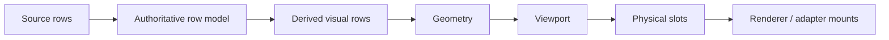
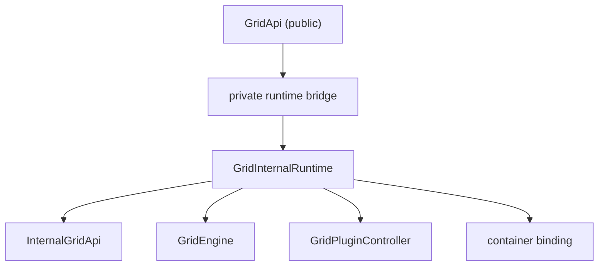

# Plan 112: Alpha Foundation Report

Date: 2026-06-19

## Status

Plan 112 is complete.

This report is the milestone artifact set for the internal `0.1.0-alpha` foundation cut after Plans 103–111. It supersedes the earlier readiness audit and in-flight checklist documents.

## Foundation Decision

`GridStore` remains in the codebase, but only as a private runtime composition root.

What is enforced now:

- stable package entrypoints do not export `GridStore`
- stable package entrypoints do not export mutable `GridState` or `InternalGridState`
- adapter-facing `@eregister/wit-grid-core/internal` exports only `mountGridHost` and `hasImperativeRendererCapability`
- the internal API bridge stores a narrow runtime handle, not a concrete `GridStore`
- public consumers receive `GridApi`, `GridStateSnapshot`, and `PersistedGridState`, not mutable runtime state

## Final Architecture

### Mutation path

```mermaid
flowchart LR
    A["Public API intent"] --> B["Typed command / feature method"]
    B --> C["GridChange"]
    C --> D["GridChangeApplier"]
    D --> E["Atomic state commit"]
    E --> F["Domain versions"]
    F --> G["Declared invalidations"]
    G --> H["History / notifications / faults"]
    H --> I["FrameCoordinator"]
    I --> J["Physical renderer"]
    J --> K["Optional adapter bridge"]
```



### Row path



### Runtime boundary



## Public API and Package Entry Points

### `@eregister/wit-grid-core`

Stable runtime exports are intentionally narrow and include:

- creation: `createClientGrid`, `createServerGrid`, `createApiFacade`
- persistence/theme/filter helpers: `createLocalStorageAdapter`, `validateSchemaVersion`, `resolveColumnFilterDef`, `createTheme`
- public registries and enums: `GridEventName`, `GridMetric`
- stable feature helpers retained in the alpha surface: `registerGridContextMenu`, `registerGridNavigation`

Explicitly not exported from the stable entry:

- `GridStore`
- `GridEngine`
- `RenderEngine`
- `RowRenderer`
- `GridState`
- `InternalGridState`
- renderer classes and runtime bridge helpers

### `@eregister/wit-grid-core/experimental`

Experimental runtime exports remain quarantined under the explicit experimental entry.

### `@eregister/wit-grid-core/internal`

Adapter-only runtime exports:

- `mountGridHost`
- `hasImperativeRendererCapability`

No bridge escape hatches, raw store, engine, or renderer classes are exported.

### `@eregister/wit-grid-react`

Stable runtime exports remain focused on:

- `Grid`
- stable hooks: `useGridApi`, `useGridSelector`, `useGridKeySelector`
- selected built-in editors/renderers and theme helpers

Portal and formula/filter bridge helpers remain in `@eregister/wit-grid-react/experimental`.

## Alpha Feature Matrix

The alpha feature matrix is the `alphaFeatureMatrix` set in [feature-registry.json](C:/Users/rishi/witbybit/wit-grid/docs/architecture/feature-registry.json).

Foundation/reference features retained for alpha:

- client row model
- column virtualization
- cell selection and navigation
- inline editing
- virtual scroll
- column resize
- row geometry
- frame coordinator
- grid API
- grid events
- diagnostics
- server row model
- grouping and aggregation
- pagination
- column reorder
- floating filters
- filter chip bar
- status bar
- clipboard
- CSV export
- state persistence
- cell validation

## Benchmark and Correctness Evidence

Baseline references:

- [baseline.json](C:/Users/rishi/witbybit/wit-grid/docs/architecture/baseline.json)
- [benchmark-scenarios.json](C:/Users/rishi/witbybit/wit-grid/docs/architecture/benchmark-scenarios.json)
- [plan-111-scheduler-simplification-report.md](C:/Users/rishi/witbybit/wit-grid/docs/architecture/plan-111-scheduler-simplification-report.md)

Milestone verification run:

- `corepack pnpm --filter @eregister/wit-grid-core exec vitest run src/perf/instrumentedBudgets.test.ts`
- result: passed

Interpretation:

- the Plan 091 instrumentation budget suite remained green after the 103–112 convergence work
- no benchmark regression was introduced in the guarded correctness-budget scenarios

## Memory and Lifecycle Evidence

Milestone verification run:

- `corepack pnpm --filter @eregister/wit-grid-core exec vitest run src/performance.test.ts src/lifecycle.adversarial.test.ts`
- `corepack pnpm --filter @eregister/wit-grid-core exec vitest run src/rowModel.adversarial.test.ts src/lifecycle.adversarial.test.ts src/serverRowModel.adversarial.test.ts src/gridHost.adversarial.test.ts`

Result:

- all suites passed
- lifecycle teardown, remount, and host-binding adversarial checks remained green
- the packaged performance suite, including the memory-footprint coverage already encoded there, remained green

## Package and Real-App Integration Report

Tarball consumer verification:

- `node .\scripts\pack-verify.mjs`
- result: passed
- outcome: both published tarballs compiled in the external `fixtures/package-consumer` fixture

Real app verification:

- `corepack pnpm --filter demo-app build`
- result: passed
- outcome: the demo app builds against supported package entrypoints only

## Clean-Checkout Command Transcript

The following command set was re-run for the Plan 112 milestone:

```text
corepack pnpm --filter @eregister/wit-grid-core exec vitest run src/boundary.test.ts src/engine/architectureGuards.test.ts src/gridHost.test.ts src/gridHost.adversarial.test.ts
corepack pnpm run test:architecture
corepack pnpm --filter @eregister/wit-grid-core exec vitest run src/rowModel.adversarial.test.ts src/lifecycle.adversarial.test.ts src/serverRowModel.adversarial.test.ts src/gridHost.adversarial.test.ts
corepack pnpm --filter @eregister/wit-grid-core exec vitest run src/perf/instrumentedBudgets.test.ts
corepack pnpm --filter @eregister/wit-grid-core exec vitest run src/performance.test.ts src/lifecycle.adversarial.test.ts
corepack pnpm --filter @eregister/wit-grid-core test
corepack pnpm --filter @eregister/wit-grid-core build
corepack pnpm --filter @eregister/wit-grid-react test
corepack pnpm --filter @eregister/wit-grid-react build
node .\scripts\pack-verify.mjs
corepack pnpm --filter demo-app build
```

Observed environment note:

- the root `test:adversarial` script hit a Corepack permission/usage limitation in this session, so the equivalent package-level adversarial suites were run directly instead
- the React adversarial file is included by the full `@eregister/wit-grid-react` package test run, which passed

## Deleted-Path Inventory

The 103–112 chain removed or sealed the following pre-foundation paths:

- public `setState` forwarding from the store surface
- raw mutation compatibility methods on the stable API path
- ambiguous commit results such as `faulted`
- controller-owned history registration outside the commit boundary
- legacy inferred invalidation fallback paths
- stable export of mutable runtime `GridState`
- public recovery of the internal runtime/store object
- React-side dependence on store downcasts or internal engine casts
- adapter-facing dependence on `store.ts` types for cell pointer/access contracts

## Known Limitations

The following capabilities remain intentionally non-foundation:

- `formula-dag` — incubating
- `undo-redo` — incubating
- `column-auto-size` — incubating
- `header-menus` — incubating
- `chart-overlay` — incubating
- `spreadsheet-fill-range` — deferred

These limitations are tracked in [feature-registry.json](C:/Users/rishi/witbybit/wit-grid/docs/architecture/feature-registry.json) and are not part of the stable alpha promise.

## Post-Foundation Roadmap

The next review should focus on:

- release hardening
- accessibility and browser-compatibility follow-through
- documentation polish and API ergonomics
- packaging and product fit
- incubating feature graduation or deletion

The next review should not need to re-open foundational ownership questions around mutation authority, invalidation authority, runtime-state exposure, or adapter/store escape hatches.
